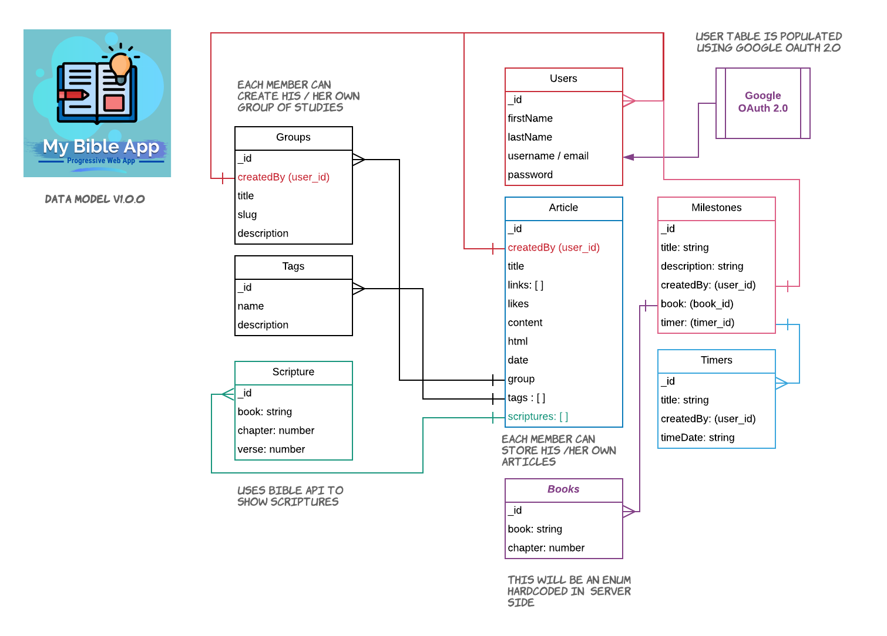

# My Bible App

This is a clone repository of `I-AM-BORED` which is a Progressive Web application for maintaining my bible notes.

## Data Model

## Tech Stack

### Backend / API
- Node JS
- Express
- Mongo DB
- Mongoose
- Unirest (Bible API)

### Frontend
- React
- Typescript
- Material-UI
- Styled Components (Optional)

### Testing
- Jest (React)
- Mocha (Express)

### Automation
- Github Actions
- JMeter (API Testing & Automation) 

### Uses Bible API

- Link : https://radpidapi.com
- API Key: `be4666b0d2msh7df854409ac980bp11bc3ajsncf32b40c5d2a`

### Google OAuth Credentials

- Client ID: `896192510998-26lofha1h9lehlo1ofq4llhhfaualul9.apps.googleusercontent.com`

- Client Secret: `LLZQYK2pOCf4gph_pKhu5L0o`

